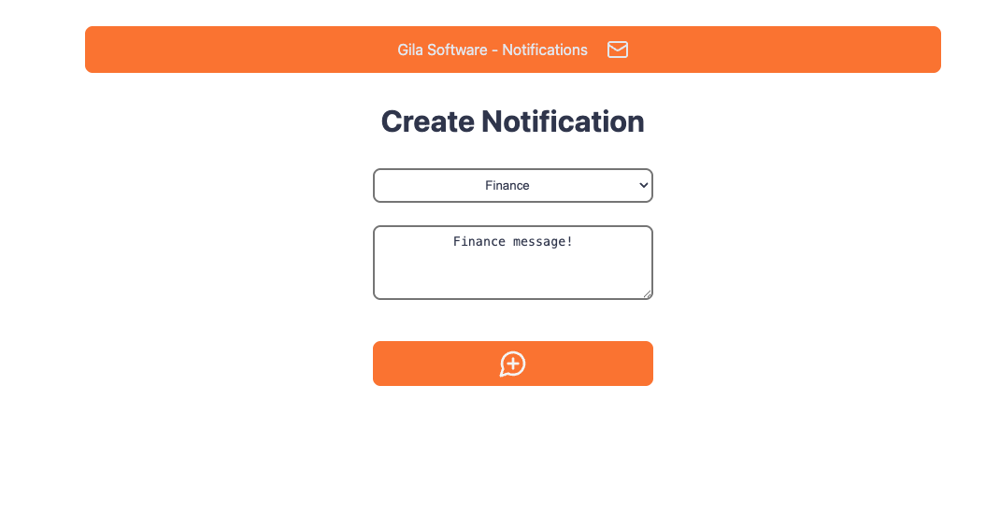
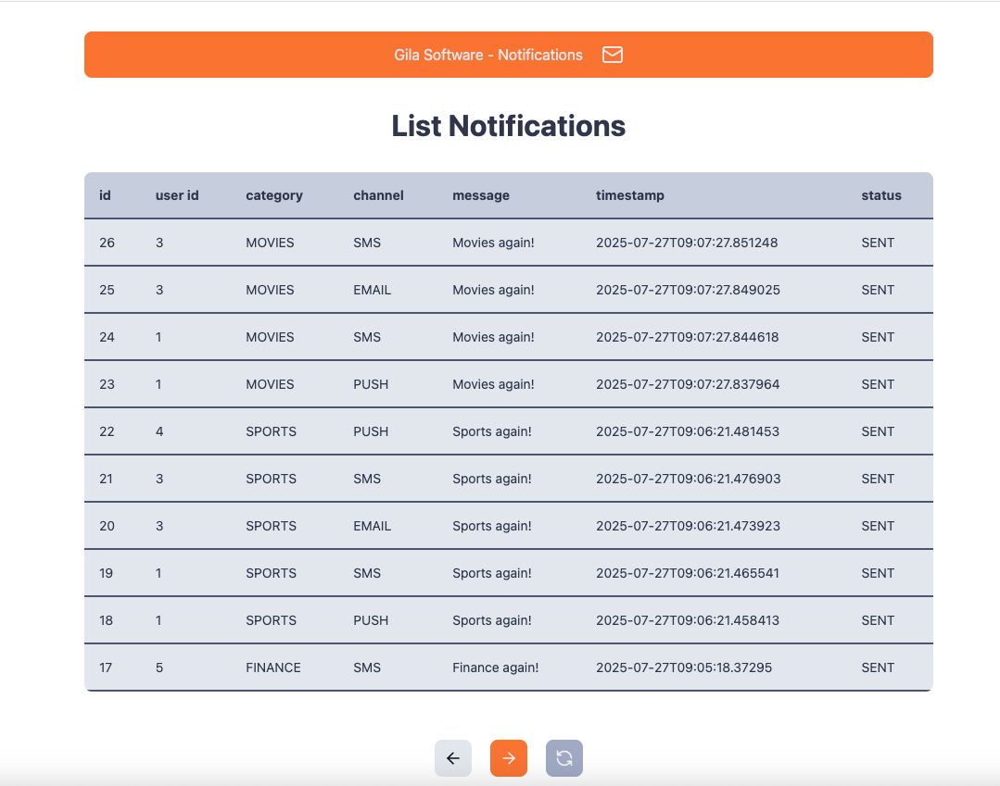

# 📬 Notification System
### study-notification-frontend

Hello!
This is a study repo for a simple front-end using React with 2 screens.


It is composed of a frontend interface (this repo) and a backend application ([link](https://github.com/GHBAlbuquerque/study-notification-backend)).

## Description

This is the **frontend** for the Backend Notification system, built with **React**.  
It provides a simple UI to list and manage notifications.

Routes:
- '/' - Create Notification
- '/notifications' - List Notifications

Available Categories:
- Movies
- Finance
- Sports

Available Channels:
- SMS
- Push
- Email

---

## 🏛️ Architecture

```bash
📁 src
├── 📁 api         # Service class for API use
├── 📁 components  # Interface components
├── 📁 models      # Data representation
├── 📁 pages       # Main pages
├── 📁 routers     # Navigation logic
└── 📁 styles      # CSS and styling
```


---

## 🛠 Technology

- ⚛️ **React** (with TypeScript)
- 📦 **npm** for package management
- 💅 **CSS Modules** or global styles (under `/styles`)
- 🔁 **React Router** for navigation
- 🌱 **Vite**
- 🎲 **Lucide Icons**
- 🧰 **ESLint + Prettier** for code formatting and linting
- 🧪 **Vitest** for unit and integration testing
- 🧩 **@testing-library/react** for testing React components

---

## 🛠 UI

'/' - Create Notification


'/notifications' - List Notifications

---


## ▶️ How to Run

### Prerequisites

Make sure you have the following installed:

- [Node.js](https://nodejs.org/en/download/) (v16+ recommended)
- npm (comes with Node)

---

### 🛠️ Installation

Clone the repository:

```bash
git clone https://github.com/your-username/study-notification-frontend.git
cd study-notification-frontend
```

Install dependencies:

```bash
npm install
```

### ▶️ Running the App

To start the development server:

```bash
npm run dev
```

### ▶️ Running tests

To run all tests:

```bash
npm run test
```

---

Made with ☕  by @GHBAlbuquerque


